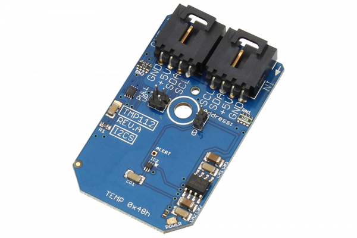

# TMP112

The TMP112 offers high-accuracy digital temperature measurement in a low-cost package.The TMP112 is ideal for NTC/PTC thermistor replacement where high accuracy is required
This Device is available from www.ncd.io 

[SKU: TMP112]

(https://store.ncd.io/product/tmp112-temperature-sensor-%C2%B1-5c-12-bit-i2c-mini-module/)
This Sample code can be used with Arduino.

Hardware needed to interface TMP112 sensor with Arduino

1. <a href="https://store.ncd.io/product/i2c-shield-for-arduino-nano/">Arduino Nano</a>

2. <a href="https://store.ncd.io/product/i2c-shield-for-arduino-micro-with-i2c-expansion-port/">Arduino Micro</a>

3. <a href="https://store.ncd.io/product/i2c-shield-for-arduino-uno/">Arduino uno</a>

4. <a href="https://store.ncd.io/product/dual-i2c-shield-for-arduino-due-with-modular-communications-interface/">Arduino Due</a>

5. <a href="https://store.ncd.io/product/tmp112-temperature-sensor-%C2%B1-5c-12-bit-i2c-mini-module/">TMP112 Temperature Sensor</a>

6. <a href="https://store.ncd.io/product/i%C2%B2c-cable/">I2C Cable</a>

TMP112:

The TMP112 offers high-accuracy digital temperature measurement in a low-cost package.The TMP112 is ideal for NTC/PTC thermistor replacement where high accuracy is required

Applications:

• Battery management

• Computer peripheral thermal protection

• Electromechanical device temperature monitoring etc.

How to Use the TMP112 Arduino Library

The TMP112 has a number of settings, which can be configured based on user requirements.
          
1.One shot mode:The following command is used to DISABLE the one shot mode..

             tmp.setOneShot(ONESHOT_DISABLED);        // Disabled
            
2.Shut down mode:The following command is used to DISABLE the shut down mode.

            tmp.setShutdown(SHUTDOWN_DISABLE);      // Disable
            
